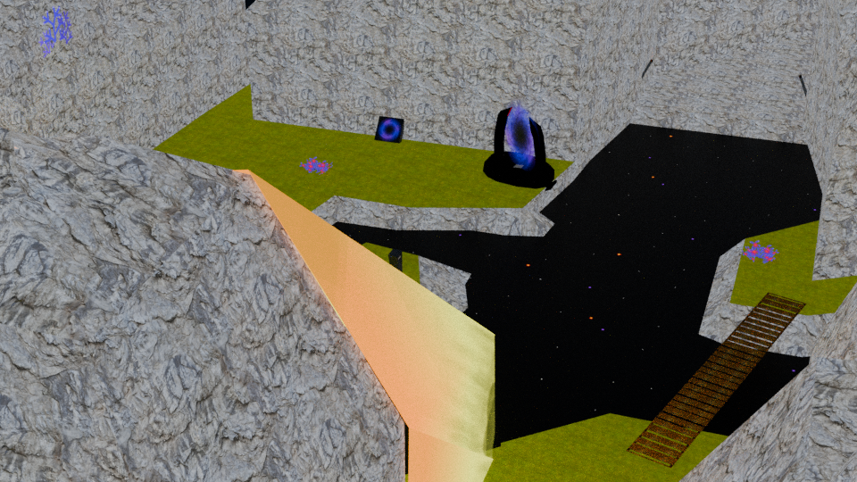
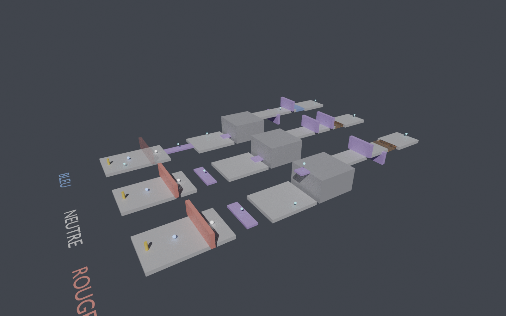

# Naball sous Unity : tranche verticale Ger_FieldSwamp

Ce dossier est un projet Unity 6 qui reprend le hub du jeu, **Ger_FieldSwamp** (l'Île Cosmologique),
à partir du `.blend` original, avec **Lumka** comme héros (le personnage du prototype
[lumka-player](https://gitlab.com/piwel-lumka/lumka-player)). Les 20 Clims se ramassent et sont sauvegardés,
les 6 portails respectent l'avancement, les zones musicales et les dialogues fonctionnent.



## Ouvrir le projet

1. Unity Hub › *Add project from disk* › choisir ce dossier `Unity/` (Unity 6000.0 LTS).
2. À la première ouverture, le script `LevelBuilder` construit tout seul `Assets/Naball/Scenes/Ger_FieldSwamp.unity`
   (matériaux, prefabs de Lumka et du Clim, Animator de Lumka, colliders, sons, portails). On peut le relancer via le menu
   **Naball › Construire Ger_FieldSwamp**. Si la scène existait déjà avec la boule, ce menu la reconstruit avec Lumka.
   **Naball › Construire Ger_FieldSwamp avec la boule d'origine** remet la boule du jeu Blender, pour comparer.
3. Ouvrir la scène et appuyer sur Play. Lumka tombe du ciel sur l'île, comme la boule au premier passage dans l'original.
   Un clic dans la fenêtre de jeu capture la souris pour la caméra, Échap la libère.

La console affiche la conversion d'axes Blender → Unity que le builder a vérifiée sur les objets du niveau.
Un avertissement à cet endroit signifie que les points d'apparition risquent d'être décalés.

## Commandes

| Clavier (AZERTY ou QWERTY) | Manette | Action |
|---|---|---|
| ZQSD, WASD ou flèches | stick gauche (analogique) | courir, dans la direction de la caméra |
| Espace (maintenir = plus haut) | A | sauter |
| F / R | LB / RB | basculer d'un cran vers le bleu / le rouge (bascule libre, premier Atomium) |
| Maj | B | dash, au sol ou une fois en l'air (¼ de la jauge d'énergie) |
| clic gauche | X | tir vers là où regarde la caméra (1/10 de la jauge) |
| souris | stick droit (si l'axe `RightStickX/Y` existe) | caméra |
| Entrée, Espace ou clic | | dialogue suivant |
| F5 / F6 | | avancement du hub −1 / +1 (éditeur uniquement) |
| F9 | | repartir d'une sauvegarde vierge (éditeur uniquement) |

La jauge d'énergie (en haut à gauche, sous les Clims) remonte seule après une courte pause et clignote en rouge
quand elle ne suffit pas.

## Dimensions (4D) et salles greybox

La 4D est la boucle de jeu principale (voir `docs/scenario.md`). `DimensionSystem` tient la dimension courante,
de −1 (bleu) à +1 (rouge), qui glisse vers sa cible en une demi-seconde environ. Les `DimensionalObject` se
décalent, tournent ou disparaissent selon elle, et portent Lumka pendant qu'ils bougent. Les fruits 4D
imposent une dimension, et la bascule libre (F / R) coûte de l'énergie.

Les niveaux se prototypent en texte : chaque fichier de `Assets/Naball/Greybox/` décrit une salle
(format dans `Assets/Naball/Greybox/LISEZMOI.md`), et **Naball › Construire les salles greybox** en fait
une scène jouable. `SalleTest4D` enseigne la mécanique en quatre salles : fruit, pont qui s'aligne,
ascenseur qui monte en rouge, murs et lave qui changent selon la dimension.




## Lumka : ce qui change par rapport au prototype

`LumkaController` remplace celui du prototype (`Assets/Scripts/characters/lumka/LumkaController.cs` dans lumka-player)
en gardant ses idées (saut variable, dash et tir sur une jauge d'énergie) :

| Prototype 2021 | Ici |
|---|---|
| Déplacement par `transform.Translate` : traverse les murs fins, ignore les pentes | Vitesse du Rigidbody, qui suit la pente du sol et glisse le long des murs |
| 8 directions, vitesse tout ou rien, demi-tour instantané | Direction analogique (manette), accélération, freinage et virage progressifs |
| Saut seulement si le rayon d'1 m touche le sol à l'instant de l'appui | *Coyote time* (0,12 s après un rebord) et appui mémorisé 0,15 s avant l'atterrissage |
| Clavier AZERTY uniquement, pas de manette | AZERTY, QWERTY et manette |
| Caméra qui suit sans commande | Caméra orbitale à la souris, recentrage automatique, évite de traverser les murs |
| Animator dont les états modifiaient le contrôleur (`LumkaSprint`, `LumkaShoot`) | Animator généré, piloté par six paramètres ; le tir n'anime que le haut du corps |

Le modèle, les animations, les textures et les sons viennent tels quels du prototype (`Assets/Lumka`, avec leurs `.meta`).
Les matériaux, qui utilisaient un shader graph URP très simple (texture + émission), sont recréés en Standard par
`LumkaBuilder`, ce qui évite de passer le projet sous URP pour l'instant.
Pas encore repris : le mode combat (Ctrl), les fruits 4D et les dimensions, le Somtraj, l'accroche aux rebords
(les animations `grimpe_rebord` et `supendu` sont dans le FBX).

## Ce qui est porté

| Original | Unity |
|---|---|
| Objet `Cube` et ses 44 logic bricks | `LumkaController` ; la boule reste disponible (`NaballController`, vitesses converties à 60 ticks/s) |
| Actuator Camera de `Ger.cam` | `FollowCamera` (caméra orbitale) |
| `ger.clim1..20` + `Clim_white` (Steering, message `Add` au HUD) | `ClimSpawner`, `ClimPickup` |
| `Ger.portal.*` (Collision + `alr > n`, écran Load_lvl) | `Portal` ; les niveaux pas encore portés affichent un message |
| `AudiViews.GerMod` | `SoundField` (volume = 1 − distance / rayon) |
| `DlgInvocation` + `Ressources/Dialog.py` | `DialogSystem`, `DialogTrigger`, textes de `Assets/lang` convertis en JSON |
| `Maps/Ger.py` + `gameInstance/Cont/ger.sii` | `LevelDirector` (apparition, caméra, dialogue d'accueil, lumière selon l'avancement) |
| Fichiers `.gs` relus avec `eval()`, toujours dans `save1/` | `GameState` : un JSON par emplacement dans `Application.persistentDataPath` |

## Pas encore porté

- Les autres niveaux, les menus, le HUD complet (vie, Atomiums, cages) et les cinématiques.
- Le tir (*Eta*), *Solidify*, les Clims violets et rouges, l'OVNI, les nénuphars et les bateaux.
- Les matériaux ne gardent que leur première texture : les mélanges de textures du terrain et le défilement
  de l'eau (`Uv_scroll.py`) sont à refaire, de même que le spot qui suivait la boule (remplacé par un soleil).
- Ger_FieldSwamp ne contient aucun ennemi, donc l'IA des Terioriams viendra avec un autre niveau.

## Régénérer les données depuis le `.blend`

Tout ce qui est dans `Assets/Naball/{Models,Textures,Audio,Data,Resources}` est produit par les scripts de `Tools/` :

```sh
sh Unity/Tools/export_all.sh Ger_FieldSwamp   # nécessite Blender 2.8+ (testé avec 4.0) et Python 3
```

1. `extract_logic.py` lit directement `Assets/MAP_DATA.scenes` (format 2.78) avec `blendfile.py`, un petit lecteur
   écrit pour l'occasion. Il récupère ce que Blender 2.8+ a oublié : les logic bricks et leurs liens, les propriétés
   de jeu, les textures des matériaux Blender Internal et les 34 scripts intégrés au `.blend`.
2. `export_level.py`, lancé dans Blender, exporte le niveau, la boule et le Clim en FBX, avec les axes attendus par Unity.
3. `build_unity_data.py` copie modèles, textures et sons, puis écrit la description du niveau (rôle de chaque objet)
   et convertit les fichiers `.lg` en JSON.

Pour porter un autre niveau, il suffit de relancer la même chaîne avec son nom de scène, puis d'étendre `build_unity_data.py`
et `LevelBuilder` aux objets qu'il est seul à utiliser.
